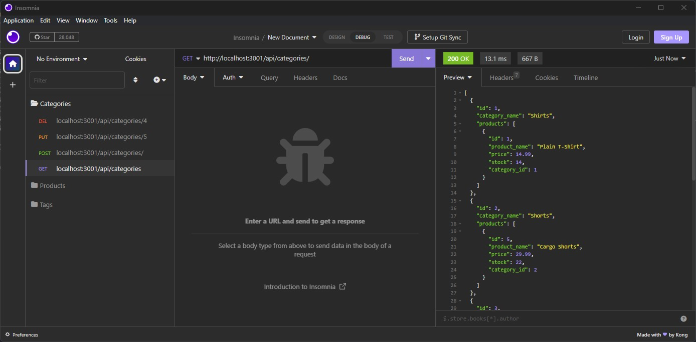
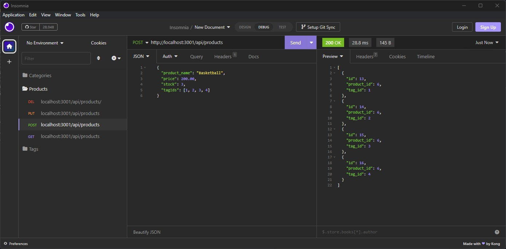
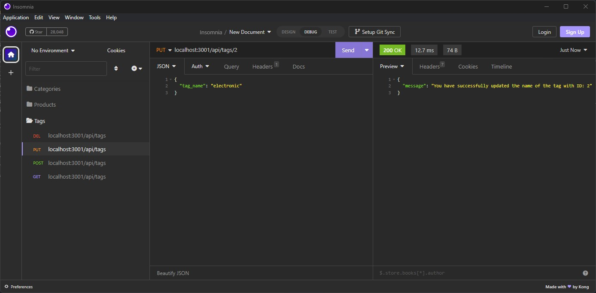
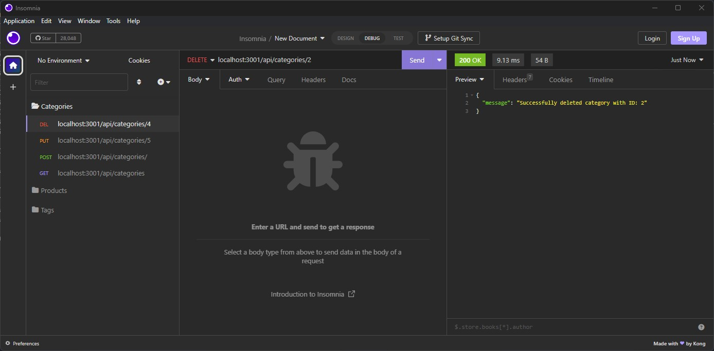

# E-commerce Backend
<figure class="video_container">
  <iframe src="https://drive.google.com/file/d/184KcGjYxH5x-9Y8_z1vV9_uoPqHweTYs/view" frameborder="0" allowfullscreen="true"> </iframe>
</figure>
Click video above for application walkthrough using seeded data!
  

## Table of Contents 
* [Description](#Description) 

* [Installation](#Installation) 

* [Usage](#Usage) 

* [License](#License) 

* [Contributing](#Contributing) 

* [Testing](#Testing) 

* [Questions](#Questions) 

* [Screenshots](#Screenshots) 

### Description
A backend application intended to be paired with an e-commerce front end. The application uses Sequelize, a modern Object Relational Mapper used with MySQL database. Insomnia was used to ensure functionality of routes and will be shown in the application walkthrough video. 

### Installation
1. Project is setup to use an .env file to protect sensitive database usernames and passwords. Using the supplied .env.EXAMPLE file in root directory, rename file to be that of .env (removing .EXAMPLE) and fill in required variables of DB_USER and DB_PASSWORD with your own mySQL username and password.
2. Run mySQL in root folder. source db/schema.sql to setup working database. 
3. `npm install` into root directory, to install required application dependencies. 
    - [optional] `npm run seed` to seed database with pre-supplied data.
4. `npm start` to start application.

### Usage
Available npm scripts: 
- test
- start
- watch
- seed

### License
Further information regarding this specific license can be found via: https://opensource.org/license/mit/.  
 

### Contributing
Open <a href="https://github.com/MisterBham/ecom-backend/issues">Issues</a> on the Github repo!

### Testing
npm test

### Questions
Should you have any further questions, please reach the developer at: misterbham.dev@gmail.com.  
GitHub: <a href="https://github.com/MisterBham">MisterBham</a>

### Screenshots
  
  
  
  
